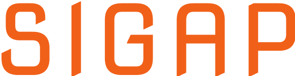
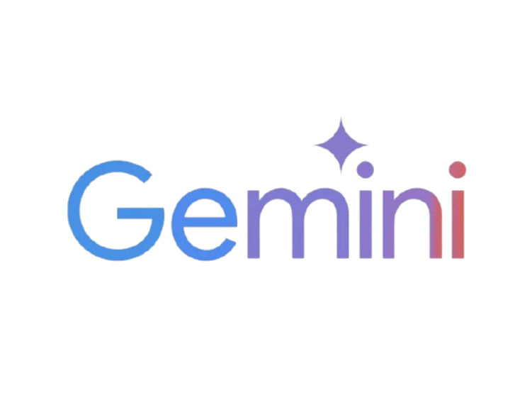
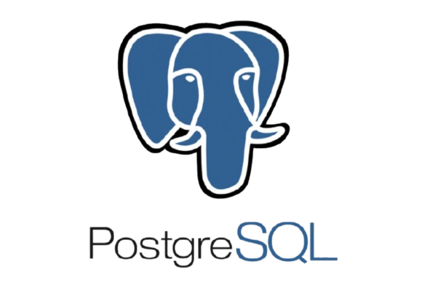
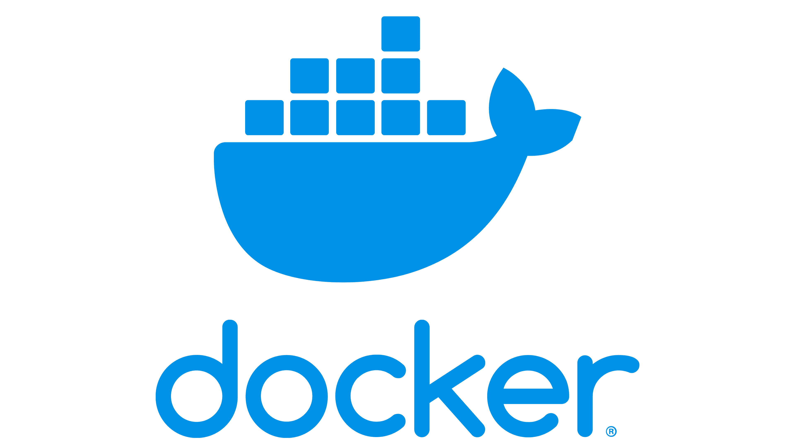

```
<div align="center">
  
  <h1>SIGAP</h1>
  <p><strong>Smart Intervention for Guarding Against Stroke</strong></p>
</div>

## 🌟 About SIGAP
SIGAP is an AI-powered gamified health platform designed to prevent stroke through personalized risk assessments, engaging gamification elements, and community support. Our solution addresses the critical need for effective stroke prevention in Indonesia, where stroke prevalence has reached 8.3 per 1,000 population and accounts for 18.5% of total deaths.

<div align="center">
  
</div>

## 🌊 Background & Motivation
Stroke remains a leading cause of death and disability worldwide, with a significant impact on Indonesia. Despite the availability of various health applications, many lack personalization and engaging elements, leading to suboptimal user adherence. Research indicates that gamification can effectively facilitate behavior change and enhance user engagement in health interventions. However, there is a scarcity of platforms that integrate AI-driven personalized risk assessments with gamified health promotion strategies specifically targeting stroke prevention.

## 💡 Key Features

### 🔮 Personalized Stroke Risk Prediction
- AI-powered algorithms analyze individual health data, lifestyle habits, and known risk factors
- Tailored recommendations and action plans to mitigate identified risks
- Regular progress tracking and risk reassessment

### 🎮 Gamified Health Improvement Journey
- Engaging challenges, rewards, and progress tracking to motivate users
- Points and badges for completing health-related activities
- Achievement system fostering continuous engagement

### 🍎 AI-Based Nutrition Monitoring
- Photo-based food logging for easy meal tracking
- AI analysis of caloric and nutritional content
- Personalized dietary feedback and recommendations
- Healthy food suggestions based on user preferences and health needs

### 🏃‍♀️ Activity Tracking
- Jogging and yoga tracking with real-time metrics
- Personalized workout recommendations
- Activity history and progress visualization

### 🤖 Personalized Health Chatbot
- AI-powered health assistant for guidance and motivation
- Answers to health questions and concerns
- Reminders and tips for maintaining healthy habits

## 🧰 Technology Stack

<div align="center">
  
  
  
  
  
  
</div>

### Frontend
- **Flutter**: Cross-platform UI toolkit for building natively compiled applications
- **BLoC Pattern**: For state management and separation of concerns
- **RESTful API Integration**: Seamless communication with backend services

### Backend
- **Golang**: High-performance backend API
- **Supabase**: Backend-as-a-Service for authentication and database management
- **PostgreSQL**: Reliable database for storing user data and application information
- **Gemini AI**: Advanced AI model for personalized health insights and recommendations
- **Docker**: Containerization for consistent deployment and scalability

## 🚀 Getting Started

### Prerequisites
- Flutter SDK (latest version)
- Go 1.19+
- Docker & Docker Compose
- PostgreSQL
- Supabase account
- Gemini API key

### Installation & Setup

#### Backend Setup
```bash
# Clone the repository
git clone https://github.com/yourusername/sigap-app.git
cd sigap-app/backend

# Set up environment variables
cp .env.example .env
# Edit .env file with your credentials

# Run with golang
go run main.go
```

#### Frontend Setup
```bash
# Navigate to frontend directory
cd ../frontend

# Install dependencies
flutter pub get

# Run the application
flutter run
```

## 📱 Application Structure

### Backend Structure
```
📁 backend/
    📁 config/         # Application configuration
    📁 controllers/    # Request handlers
    📁 middlewares/    # Custom middleware functions
    📁 models/         # Data models
    📁 repository/     # Data access layer
    📁 routes/         # API routes
    📁 services/       # Business logic
    📁 utils/          # Helper functions
    📄 main.go         # Application entry point
```

### Frontend Structure
```
📁 frontend/
    📁 assets/         # Images, fonts, and other static files
    📁 lib/
        📁 blocs/      # Business Logic Components
        📁 config/     # App configuration
        📁 models/     # Data models
        📁 providers/  # Provider components
        📁 services/   # API services
        📁 shared/     # Shared components
        📁 ui/         # UI components and pages
        📄 main.dart   # Application entry point
```

## 🌐 API Endpoints
The SIGAP backend API is deployed and available at:
```
http://69.62.82.146:3000/api
```

Main endpoints include:
- `/api/auth` - Authentication endpoints
- `/api/profile` - User profile management
- `/api/assessment` - Health risk assessment
- `/api/activity` - Activity tracking
- `/api/food` - Food logging and analysis
- `/api/chatbot` - Chatbot interaction
- `/api/coin` - Rewards system

## 👨‍💻 Contributors
This project was developed as part of the Google Solution Challenge 2025 by:
- Habdil Iqrawardana - Husler
- Rakha Dzikra Guevara - Hipster
- Khoirul Rizal Kalam - Hacker (Frontend Developer)
- Abdullah Alhwyji - Hacker (Backend Developer)

## 📄 License
This project is licensed under the MIT License - see the LICENSE file for details.

## 🙏 Acknowledgements
- Google Solution Challenge 2025
- Ministry of Health Indonesia for health data
- All beta testers and supporters
```